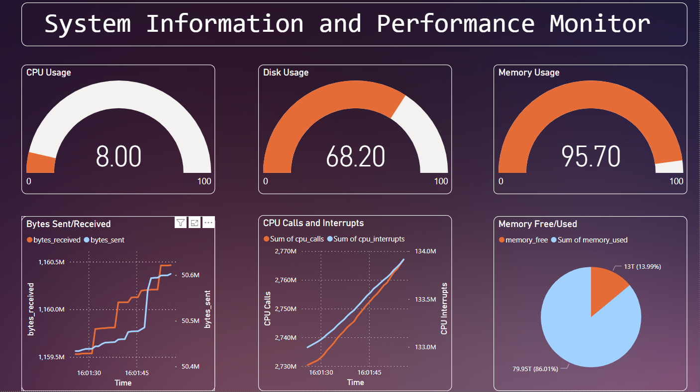
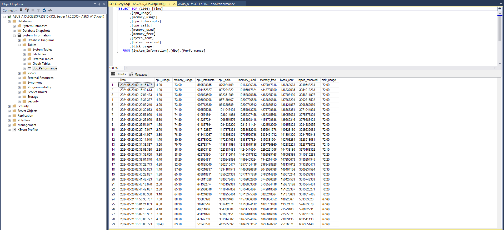

# Real-Time System Performance Monitoring and Visualization

## Overview

The Real-Time System Performance Monitoring and Visualization project is a comprehensive solution designed to monitor and visualize system performance metrics in real-time. By leveraging Python for data collection, SQL Server for efficient data storage, and Power BI for dynamic visualization, this project provides users with valuable insights into their system's performance.

## Use and Scope

This project is ideal for system administrators, IT professionals, and organizations seeking to monitor and optimize their system's performance. It offers a real-time view of critical metrics such as CPU usage, memory utilization, network activity, and disk usage, enabling users to identify performance bottlenecks, troubleshoot issues, and optimize resource utilization.

## Features

- **Real-Time Data Collection**: Collects system performance metrics every second, providing users with up-to-date information on their system's performance.
- **Efficient Data Storage**: Stores collected data in an SQL Server database, ensuring efficient storage and retrieval for large datasets.
- **Dynamic Visualization**: Utilizes Power BI to create interactive dashboards for visualizing and analyzing system performance metrics, enabling users to gain actionable insights.
- **Customization**: Allows users to customize dashboards and reports based on their specific monitoring needs and preferences.

## How to Setup

1. **Clone the Repository**: Clone the project repository to your local machine.

2. **Install Dependencies**: Install the necessary Python libraries.

3. **Set Up SQL Server Database**:
   - Install SQL Server Management Studio (SSMS) if not already installed.
   - Connect to your SQL Server instance using SSMS.
   - Execute the SQL script `Data Script.sql` to create the database and necessary tables.

4. **Run Data Collection Script**: Execute the Python script `getdata.py` to start collecting system performance metrics and storing them in the SQL Server database.

5. **Visualize Data with Power BI**: Open Power BI and connect to the SQL Server database to create interactive dashboards for visualizing system performance metrics.

## Dashboard Screenshots

